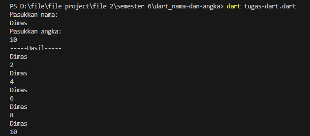

| Nama      | Dimas Riyadh Alfajri |
| ----------- | ----------- |
| NIM     | 312010029       |
| Kelas   | TI.20.A.1        |
| Matkul     | Pemrograman Mobile  |


## Tugas Membuat Program dart Bilangan Nama dan Angka

berikut adalah nama file nya `tugas-dart.dart`. dan source code nya : 

```
import 'dart:io';

void main() {
  print('Masukkan nama:');
  String nama = stdin.readLineSync()!;

  print('Masukkan angka:');
  int angka = int.parse(stdin.readLineSync()!);

  print('-----Hasil-----');
  for (int i = 2; i <= angka; i += 2) {
    print(nama);
    print(i);
  }
}
```
dan ini output nya :


